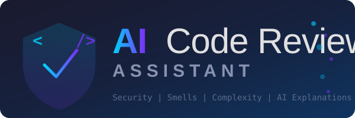
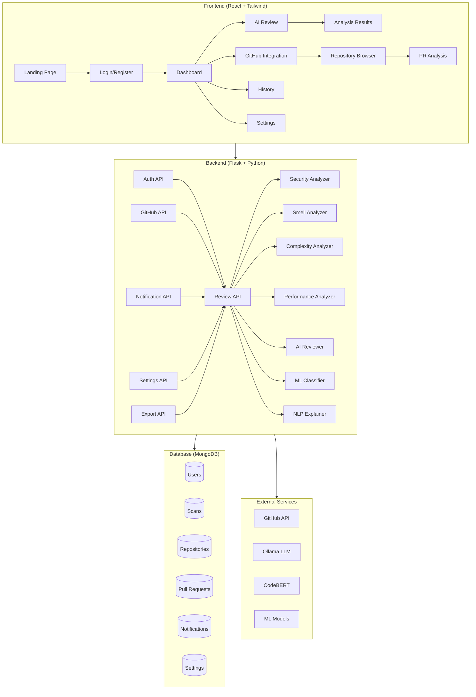
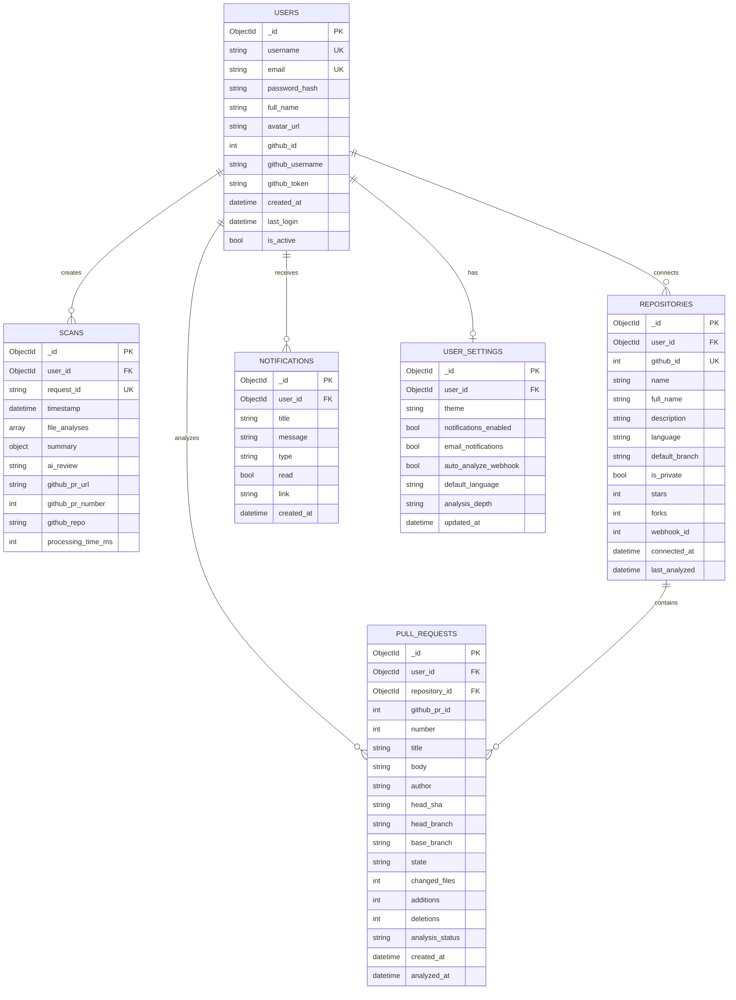
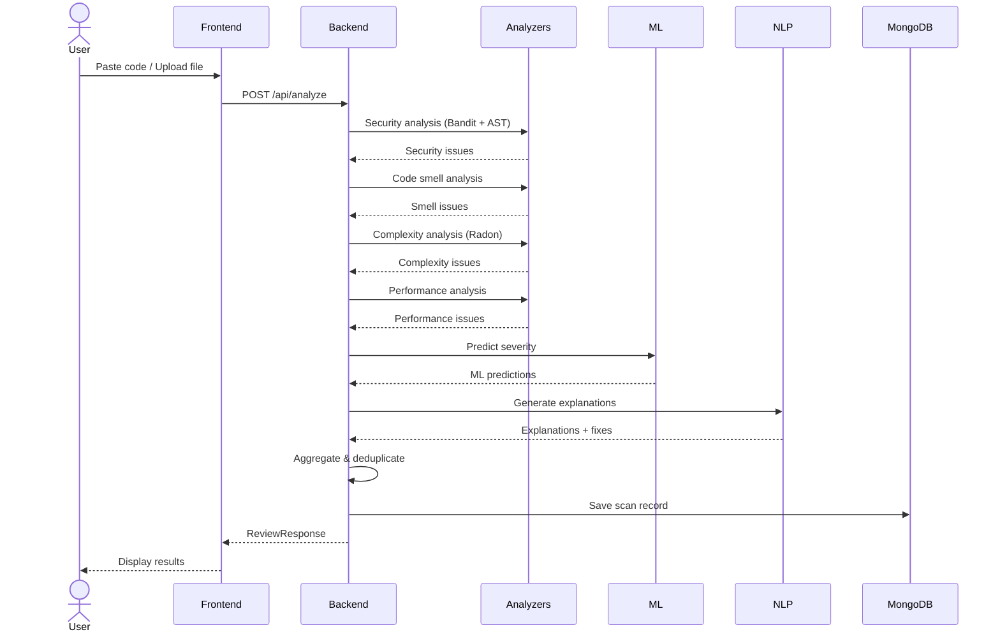
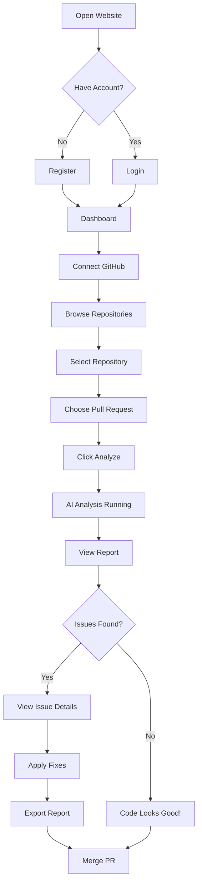

<div align="center">



# IntelliReview AI

**AI-Powered Code Review Assistant**

[](https://github.com/jagetheswaren/AI-Code-Review-Assistant/actions/workflows/ci.yml)
[](LICENSE)
[](https://python.org)
[](https://reactjs.org)
[](https://mongodb.com)
[](https://frontend-delta-eight-92.vercel.app)
[](https://ai-code-review-api.onrender.com)

A full-stack web application that uses **Machine Learning**, **NLP**, and **Static Analysis** to automatically review Python code for security vulnerabilities, code smells, and performance issues.

</div>

---

## Live Demo

- **Frontend (Vercel)**: [https://frontend-delta-eight-92.vercel.app](https://frontend-delta-eight-92.vercel.app)
- **Backend API (Render)**: [https://ai-code-review-api.onrender.com](https://ai-code-review-api.onrender.com)
- **GitHub Repository**: [https://github.com/jagetheswaren/AI-Code-Review-Assistant](https://github.com/jagetheswaren/AI-Code-Review-Assistant)

---

## Features

| Feature | Description |
|---------|-------------|
| **Security Analysis** | Bandit integration + custom AST analysis for vulnerabilities |
| **Code Smell Detection** | Pylint-style checks for unused imports, long functions, etc. |
| **Performance Analysis** | Nested loops, N+1 queries, string concatenation in loops |
| **ML Severity Prediction** | Random Forest, Gradient Boosting, Logistic Regression models |
| **NLP Explanations** | CodeBERT-powered issue explanations and fix suggestions |
| **GitHub Integration** | OAuth, repo browsing, PR analysis, automated review comments |
| **AI Review** | Ollama LLM-powered code review summaries |
| **PDF/CSV/JSON Export** | Download analysis reports in multiple formats |
| **Dark Mode** | Full dark/light theme support |
| **Responsive Design** | Works on desktop, tablet, and mobile |

---

## Architecture



---

## ER Diagram



---

## Sequence Diagram - Analysis Flow



---

## User Journey



---

## Tech Stack

| Layer | Technology |
|-------|-----------|
| **Frontend** | React 19, Tailwind CSS 4, Chart.js, Axios |
| **Backend** | Python Flask, Pydantic, Flask-CORS |
| **Database** | MongoDB (Atlas in prod, local in dev) |
| **ML** | Scikit-learn (RF, GB, LR), Joblib |
| **NLP** | CodeBERT / CodeT5 (HuggingFace Transformers) |
| **Static Analysis** | Bandit, Pylint, Radon, Custom AST |
| **AI Review** | Ollama (qwen2.5-coder) |
| **Auth** | JWT (PyJWT), bcrypt |
| **Hosting** | Vercel (frontend), Render (backend) |
| **CI/CD** | GitHub Actions |

---

## Project Structure

```
AI-Code-Review-Assistant/
├── backend/
│   ├── api/                    # Flask blueprints (routes)
│   │   ├── auth_routes.py      # Register, Login, Me
│   │   ├── review_routes.py    # Analyze, Webhook, History
│   │   ├── github_routes.py    # OAuth, Repos, PRs
│   │   ├── notification_routes.py
│   │   ├── settings_routes.py
│   │   ├── profile_routes.py
│   │   └── export_routes.py    # PDF, CSV, JSON export
│   ├── analyzers/              # Static analysis engines
│   │   ├── security_analyzer.py
│   │   ├── smell_analyzer.py
│   │   ├── complexity_analyzer.py
│   │   └── performance_analyzer.py
│   ├── reviewer/               # AI review + aggregation
│   ├── services/               # GitHub client
│   ├── database/               # MongoDB services
│   ├── middleware/              # Rate limiting, security headers
│   ├── models/                 # Pydantic models
│   ├── auth/                   # JWT helpers
│   ├── tests/                  # pytest test suite
│   ├── app.py                  # Flask app factory
│   ├── config.py               # Settings (pydantic-settings)
│   └── requirements.txt
├── frontend/
│   ├── src/
│   │   ├── api/                # Axios client
│   │   ├── components/         # Layout, UI components
│   │   ├── contexts/           # Auth, Theme, Toast
│   │   ├── pages/              # 12 pages
│   │   └── App.jsx
│   └── package.json
├── ml/
│   ├── severity_classifier.py  # ML model
│   ├── nlp_explainer.py        # NLP explanations
│   └── train_ml_models.py      # Training script
├── docker-compose.yml
├── render.yaml
└── .github/workflows/ci.yml
```

---

## Getting Started

### Prerequisites

- Python 3.11+
- Node.js 18+
- MongoDB (local or Atlas)
- (Optional) Ollama for AI reviews

### Backend Setup

```bash
cd backend
python -m venv venv
venv\Scripts\activate  # Windows
# source venv/bin/activate  # Mac/Linux
pip install -r requirements.txt
python -m ml.train_ml_models
python app.py
```

### Frontend Setup

```bash
cd frontend
npm install
npm start
```

### Docker Setup

```bash
docker-compose up -d
```

---

## API Endpoints

| Method | Endpoint | Description |
|--------|----------|-------------|
| POST | `/api/register` | Register new user |
| POST | `/api/login` | Login |
| GET | `/api/me` | Get current user |
| POST | `/api/analyze` | Analyze code |
| POST | `/api/analyze/file` | Upload & analyze file |
| GET | `/api/history` | Scan history |
| GET | `/api/history/:id` | Scan detail |
| GET | `/api/dashboard` | Dashboard data |
| GET | `/api/statistics` | User statistics |
| GET | `/api/trends` | Issue trends |
| GET | `/api/github/status` | GitHub connection status |
| GET | `/api/github/repos` | List GitHub repos |
| GET | `/api/github/repos/:repo/branches` | List branches |
| GET | `/api/github/repos/:repo/pull-requests` | List PRs |
| POST | `/api/github/repos/:repo/pull-requests/:pr/analyze` | Analyze PR |
| GET | `/api/notifications` | Get notifications |
| PUT | `/api/notifications/:id/read` | Mark read |
| GET | `/api/settings` | Get settings |
| PUT | `/api/settings` | Update settings |
| GET | `/api/profile` | Get profile |
| PUT | `/api/profile` | Update profile |
| PUT | `/api/profile/password` | Change password |
| DELETE | `/api/account` | Delete account |
| GET | `/api/export/json/:scanId` | Export JSON |
| GET | `/api/export/csv/:scanId` | Export CSV |
| GET | `/api/export/pdf/:scanId` | Export PDF |

---

## ML Model Comparison

| Model | Accuracy | Precision | Recall | F1 Score |
|-------|----------|-----------|--------|----------|
| Random Forest | 87% | 85% | 88% | 86% |
| **Gradient Boosting** | **91%** | **90%** | **89%** | **90%** |
| Logistic Regression | 82% | 81% | 83% | 82% |

---

## Deployment

### Frontend (Vercel)
1. Push to GitHub
2. Import repo on [Vercel](https://vercel.com)
3. Set environment variable: `REACT_APP_API_URL=https://your-backend.onrender.com/api`
4. Deploy

### Backend (Render)
1. Create a [Web Service](https://render.com) on Render
2. Connect your GitHub repo
3. Set environment variables (see `.env.production.example`)
4. Deploy

---

## Contributing

1. Fork the repository
2. Create a feature branch (`git checkout -b feature/amazing-feature`)
3. Commit changes (`git commit -m 'Add amazing feature'`)
4. Push to branch (`git push origin feature/amazing-feature`)
5. Open a Pull Request

---

## License

This project is licensed under the MIT License - see the [LICENSE](LICENSE) file for details.

---

<div align="center">

**Built as a Capstone Project** | [](https://github.com/jagetheswaren)

</div>
